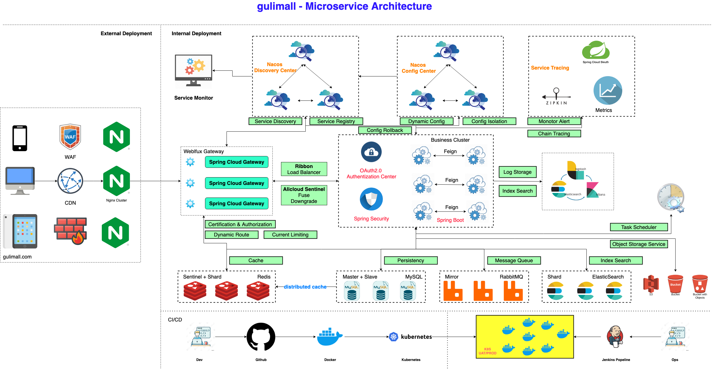

# Guli Mall

It is a practice project, which presents Microservice Architecture using Spring Cloud, Docker. It introduces Nginx to implement dynamic and static sepatation, load balancer, and reverse proxy. Alicloud Nacos is used as service discovery and configuration center. Elasticsearch and Kibana are integrated to accelerate the search service. High concurrency is imporved by using RabbitMQ and final consistency is achieved. Redis is deployed to store cache for the system. Alicloud OSS (Object Storage Service) is used to store data for internal employees. Task scheduler is set up using Cron (Command Run On) when the system is not busy. Current limiting and Fuse Downgrade are implemented via Alicloud Sentinel. Distributed Service Tracing is imported through Spring Cloud Sleuth and Zipkin.

In the cluster part, CI/CD (continuous integration / continuous deployment) is presented through Kubernetes and Jenkins.

The following diagram is the whole architecture of the gulimall system.

